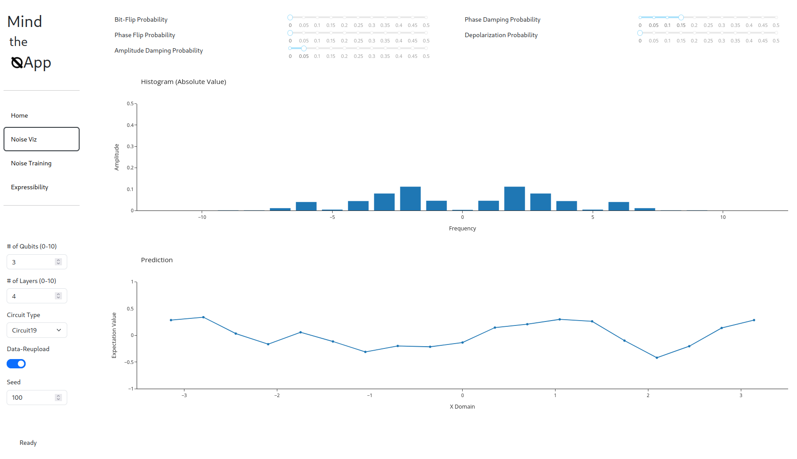
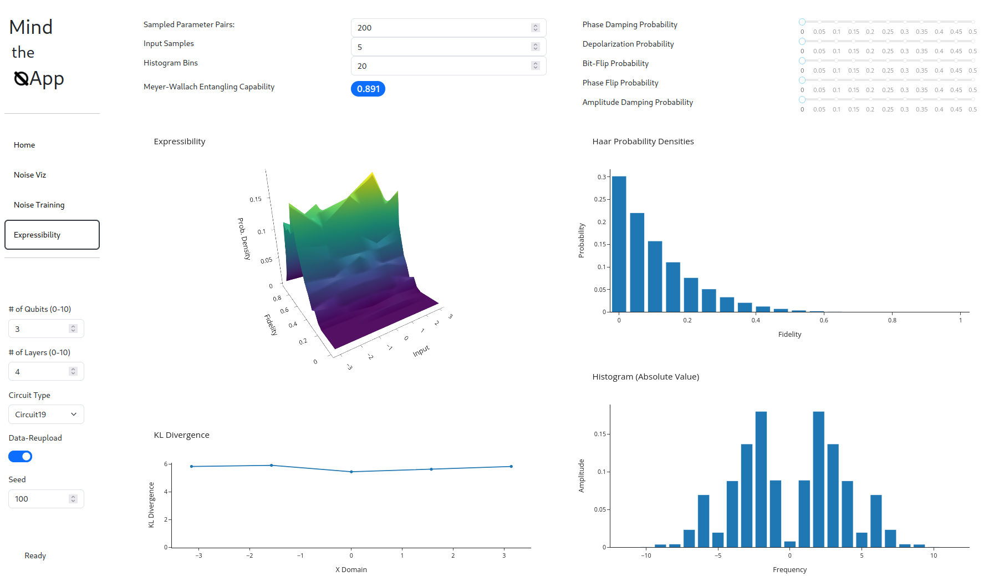

# Mind the QApp

## :scroll: About

This application serves a visualization and teaching purpose for simple training scenarios to study various effects and problems in QML.
Characteristic paramters of a QML model can be adjusted
- number of qubits
- number of layers
- type of ansatz
- data re-uploading [1]

Furthermore as noise is a non-negligible factor in Quantum Computing, the application allows the user to adjust the strength of various types of noise.
This enables to study the impact of noise on the Fourier spectrum, which can be represented with the chosen ansatz [1], both with a fixed set of parameters and within a training scenario.

We can also track the entangling capability [2] of the chosen Ansatz over the training period, so that one can evaluate the effect of parameterized entangling gates on the training performance.

The entanglement and expressibility of [3] can also be analyzed in another part of the application, distinct from the training routine, where we present a visualization of expressibility with respect to the input value. 
This is done for randomly sampled parameter values, where the distance to the Haar measure is indicated by the Kullback-Leibler divergence, as in [3].

To improve the performance, we utilize caching strategies.

## :books: References

1. [The effect of data encoding on the expressive power of variational quantum machine learning models](https://arxiv.org/abs/2008.08605)
2. [An observable measure of entanglement for pure states of multi-qubit systems](https://arxiv.org/abs/quant-ph/0305094)
3. [Expressibility and entangling capability of parameterized quantum circuits for hybrid quantum-classical algorithms](https://arxiv.org/abs/1905.10876)

## :rocket: Getting Started

1. Clone this repository
2. Run `poetry install` or install the requirements specified in `pyproject.toml` manually
3. Run `python app/app.py`
4. Navigate to `http://0.0.0.0:8050` and play around
5. 
## :camera: Screenshots

